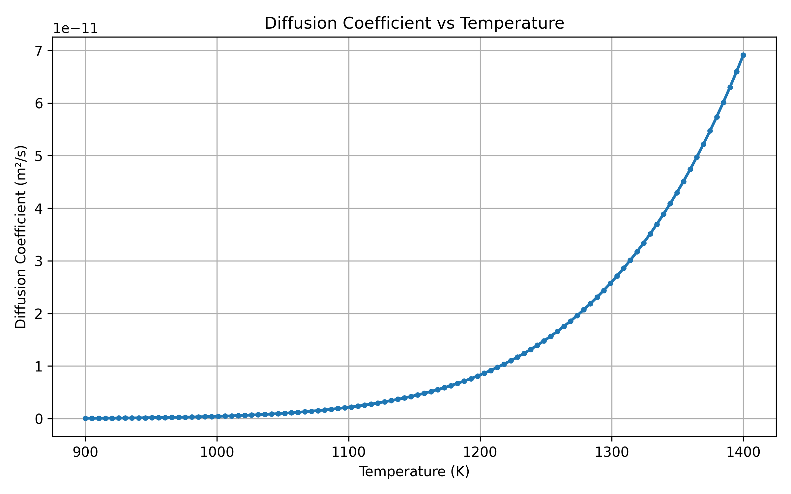
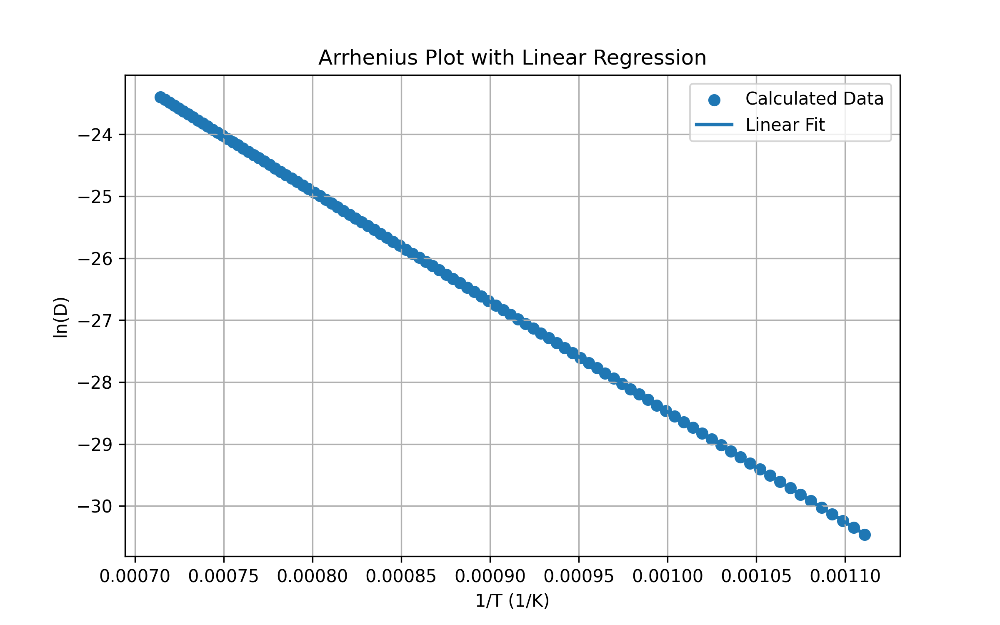

# Temperature-Dependent Diffusion Coefficient Calculator and Arrhenius Analysis

## Overview

Diffusion is a fundamental kinetic phenomenon in materials science that governs processes such as phase transformations, heat treatment, carburization, alloy homogenization, and high-temperature material behavior.

This project presents a Python-based computational tool that calculates temperature-dependent diffusion coefficients using the Arrhenius equation and visualizes diffusion behavior over a specified temperature range. The program also performs Arrhenius regression analysis to investigate the relationship between diffusion kinetics and temperature.

---

## Project Objectives

This project aims to:

- Calculate diffusion coefficients over a user-defined temperature range.
- Implement the Arrhenius diffusion equation computationally.
- Generate scientific visualizations of diffusion behavior.
- Perform linear regression analysis on Arrhenius data.
- Export calculated results for further analysis.
- Develop computational skills relevant to modern materials science research.

---

## Scientific Background

The temperature dependence of diffusion is commonly described by the Arrhenius relationship:

D = D₀ × exp(-Q/RT)

Where:

| Symbol | Description |
|----------|------------|
| D | Diffusion Coefficient (m²/s) |
| D₀ | Pre-exponential Factor (m²/s) |
| Q | Activation Energy for Diffusion (J/mol) |
| R | Universal Gas Constant (8.314 J/mol·K) |
| T | Absolute Temperature (K) |

The equation demonstrates the strong exponential dependence of atomic diffusion on temperature.

---

## Methodology

The computational workflow consists of:

1. User input of:
   - Activation Energy (Q)
   - Pre-exponential Factor (D₀)
   - Minimum Temperature
   - Maximum Temperature

2. Generation of a temperature array using NumPy.

3. Calculation of diffusion coefficients using the Arrhenius equation.

4. Construction of a structured dataset using Pandas.

5. Export of calculated results to CSV format.

6. Generation of:
   - Diffusion Coefficient vs Temperature Plot
   - Arrhenius Plot (ln(D) vs 1/T)

7. Linear regression analysis using SciPy.

8. Evaluation of:
   - Slope
   - Intercept
   - Coefficient of Determination (R²)

---

## Case Study

### Carbon Diffusion in Austenite (γ-Fe)

The following literature-based parameters were used:

| Parameter | Value |
|------------|------------|
| Activation Energy (Q) | 148 kJ/mol |
| Pre-exponential Factor (D₀) | 2.3 × 10⁻⁵ m²/s |
| Temperature Range | 900 K – 1400 K |

---

## Results

### Arrhenius Regression Analysis

| Parameter | Value |
|------------|------------|
| Slope | -17801.2990 |
| Intercept | -10.6800 |
| R² | 1.000000 |
The obtained slope is consistent with the theoretical Arrhenius relationship:

Slope = -Q/R

This validates the correctness of the implemented diffusion model and regression analysis.

The near-perfect coefficient of determination confirms the expected linear relationship between ln(D) and 1/T predicted by Arrhenius diffusion kinetics.

---

## Generated Outputs

### Data File

`diffusion_results.csv`

Contains:

- Temperature (K)
- Diffusion Coefficient (m²/s)
- Reciprocal Temperature (1/T)
- Natural Logarithm of Diffusion Coefficient (ln(D))

### Scientific Figures

#### Diffusion Coefficient vs Temperature



#### Arrhenius Plot



---

## Technologies and Libraries

- Python
- NumPy
- Pandas
- Matplotlib
- SciPy

---

## Learning Outcomes

### Materials Science Concepts

- Diffusion Fundamentals
- Atomic Transport Mechanisms
- Activation Energy
- Arrhenius Kinetics
- Temperature-Dependent Material Behavior

### Computational Skills

- Scientific Programming with Python
- Data Analysis and Processing
- Scientific Visualization
- Linear Regression Analysis
- CSV Data Export and Management

### Advanced Applications

The concepts implemented in this project form the foundation for advanced computational materials science techniques such as:

- CALPHAD
- Diffusion Modeling
- Phase Transformation Simulations
- Materials Informatics
- Machine Learning for Materials Design

---

## Project Structure

```text
Diffusion-Coefficient-Calculator
│
├── data
│   └── diffusion_results.csv
│
├── figures
│   ├── diffusion_vs_temperature.png
│   └── arrhenius_plot.png
│
├── diffusion_calculator.py
│
└── README.md
```

## Installation

```bash
pip install numpy pandas matplotlib scipy
```

## Running the Program

```bash
python diffusion_calculator.py
```

### Example Input

```text
Activation Energy (Q): 148
Pre-exponential Factor (D₀): 2.3e-5
Minimum Temperature: 900 K
Maximum Temperature: 1400 K
```

---

## Future Improvements

- Multi-material diffusion database
- Graphical User Interface (GUI)
- Comparison of multiple diffusion systems
- Automatic activation energy estimation
- Experimental data fitting capabilities
- Integration with CALPHAD-based diffusion simulations

---

References

1. Callister, W.D. and Rethwisch, D.G.,
   Materials Science and Engineering: An Introduction.

2. Shewmon, P.G.,
   Diffusion in Solids.

3. Porter, D.A., Easterling, K.E. and Sherif, M.Y.,
   Phase Transformations in Metals and Alloys.

## Author

Lakshmi Narayana  
Metallurgical and Materials Engineering  
VNIT Nagpur

Interested in Computational Materials Science, Thermodynamics, Kinetics, Diffusion Modeling, Materials Informatics, and Data-Driven Materials Engineering.
